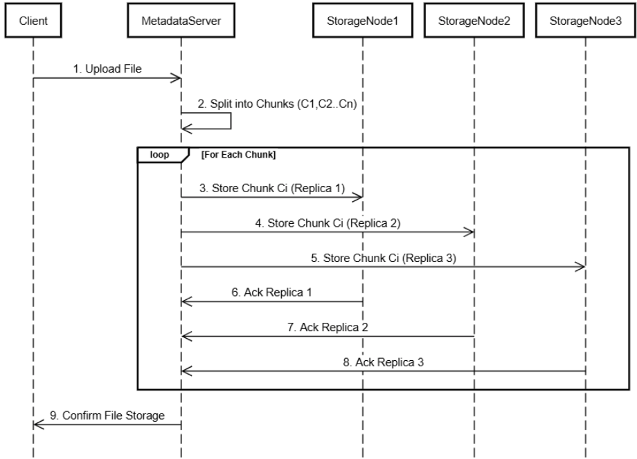
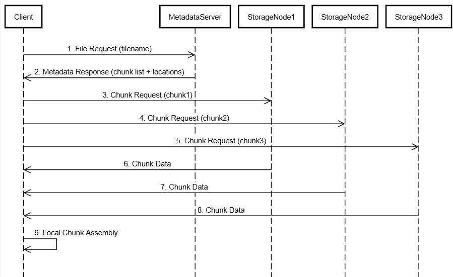

# Distributed File Storage System (DFSS)

A scalable Spring Boot metadata server that manages distributed file storage across multiple nodes. Files are split into chunks, distributed across storage nodes, and reassembled on download with integrity verification.

## Key Features
- **Smart Chunk Distribution**  
  Adaptive chunk sizing (1MB-64MB) with parallel uploads to multiple nodes
- **Strong Chunk Replication**
  Each chunk saved at least at 2 nodes simultaneously
- **Node Health Monitoring**  
  Automatic health checks with configurable intervals (default: 15s) and timeout
- **Distributed Storage**  
  Parallel chunk distribution with retry logic and concurrency control
- **File Integrity**  
  SHA-256 hash verification during upload/download
- **Scalable Architecture**  
  Dockerized PostgreSQL metadata storage with horizontal node scaling

## Tech Stack
- **Core**: Java 21, Spring Boot 3.4.4
- **Database**: PostgreSQL 15  with Spring Data JPA
- **Networking**: WebClient, Reactive Streams
- **Containerization**: Docker 26.0, Docker Compose 2.26
- **Monitoring**: Spring Actuator, Custom health registry

## System Architecture
### Components overview

```
[Client] ↔ [Metadata Server] ↔ [PostgreSQL]  
			   |  
			   |↔ [Storage Node 1]  
			   |↔ ...  
			   |↔ [Storage Node N]
```

### Basic upload example


### Basic download example


## Quick Start
### Prerequisites
- Docker & Docker Compose
- JDK 21+ (for local development)

### Metadata server start
- Firstly start the metadata server (this repository):
```bash
git clone https://github.com/Nexonm/dfs-metadata.git
docker-compose up --build
```

### Storage node start
Now, you need to start the storage nodes (to which the data will distributed and saved). Visit the [Storage Node Repository](https://github.com/Nexonm/dfs-storage-node.git) to start the nodes.

## Configuration
### Environment Variables
Change the provided environmental variables as you prefer. Basic start is already provided

```env
POSTGRES_DB=dfs_psql_db  
POSTGRES_USER=user  
POSTGRES_PASSWORD=password  
POSTGRES_HOST=dfs_metadata_db  
POSTGRES_PORT=5432
```

### Spring Application
Main parts of the `application.properties`. There defind maximum size of files to be aploaded and chunk division sizes.
```application.properties
# File size restrictions  
spring.servlet.multipart.max-file-size=500MB  
spring.servlet.multipart.max-request-size=500MB
# Chunk division configuration  
storage.chunk.size.min=1048576  
storage.chunk.size.max=67108864  
storage.chunk.count=10
# Hash configuration  
file.hash.algorithm=SHA-256
```

## API Documentation
### Summary

| Endpoint                     | Method | Description                                     |
| ---------------------------- | ------ | ----------------------------------------------- |
| `/api/files/upload`          | POST   | Upload file with hash verification              |
| `/api/files/download`        | POST   | Download file metadata (preferred)              |
| `/api/files/download/{uuid}` | GET    | (Tests only) Browser-friendly download endpoint |
| `/api/files/delete`          | DELETE | Remove file from system                         |
| `/api/node/register`         | POST   | Registers a new node into system                |

### Upload Endpoint

This endpoint allows the client to upload a file.

**Endpoint:**
```
POST /api/files/upload  
Content-Type: multipart/form-data
```

**Request Body**
- `file` (file): The file to be uploaded.
- `chunkSize` (text): The size of each chunk.

**Request example**
```bash
curl -X POST  
-F "file=your_file.type"  
-F "fileHash=9f86d081884c7d659a2feaa0c55ad015..."  
http://localhost:8080/api/files/upload
```

**Response**
- `fileUUID` (string): 36 length string of 8-4-4-4-12 pattern of hexidecimal numbers
- `originalFileName` (string): Original name of the file
- `fileType` (string): Type of the file
- `fileSize` (int) : Size of the file in bytes
- `chunkNumber` (int) : Current chunk number for chunked file operations

**Response example**
```json
{
	"fileUUID": "efb4c6b1-301f-47a6-b780-5d1e9bd72939",
	"originalFileName": "simpleText.txt",
	"fileType": "text/plain",
	"fileSizeBytes": 332,
	"chunkNumber": 2
}
```


### Download Endpoint

This endpoint provides chunk allocation details for file reconstruction.

**Endpoint:**

```text
POST /api/files/download   
Content-Type: application/json
```

**Request Body**

```json
{   
	"fileUUID": "string (required)"
}
```

|Field|Format|Description|
|---|---|---|
|fileUUID|UUID (8-4-4-4-12 hex)|Unique file identifier|

**Request Example**

bash

```bash
curl -X POST \   -H "Content-Type: application/json" \
  -d '{"fileUUID": "2e90c2b6-19b7-49be-9e7d-85488d955304"}' \  http://localhost:8080/api/files/download
```


**Response Schema**

```json
{
  "fileUUID": "string",
  "filename": "string",
  "fileSizeBytes": "integer",
  "chunks": [
    {
      "chunkUUID": "string",
      "chunkIndex": "integer",
      "chunkSizeBytes": "integer",
      "chunkHash": "string (SHA-256)",
      "hosts": [
        {
          "host": "string",
          "port": "integer"
        }
      ]
    }
  ]
}
```

**Errors**

|Code|Status|Description|
|---|---|---|
|400|Bad Request|Invalid UUID format|
|404|Not Found|File not found in metadata database|
|503|Service Unavailable|Insufficient healthy nodes for download|
